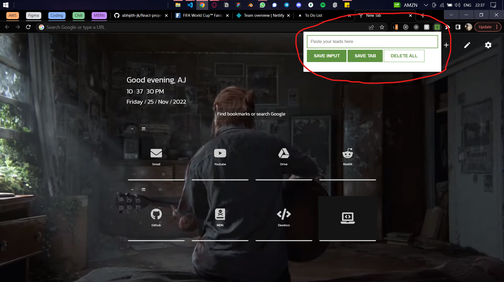

Download as a .zip file or copy paste the code to check this extension out.
Here is a screenshot of how the extension looks on the browser :

 Opening Screen of the extension  

 Saving a tab using 'Save Input' button  

 Saving a tab automatically without writing any input using 'Save Tab' button  
